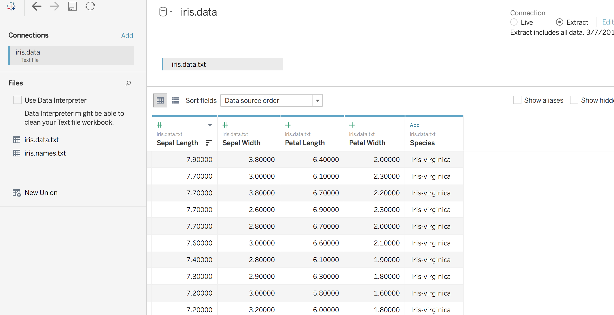
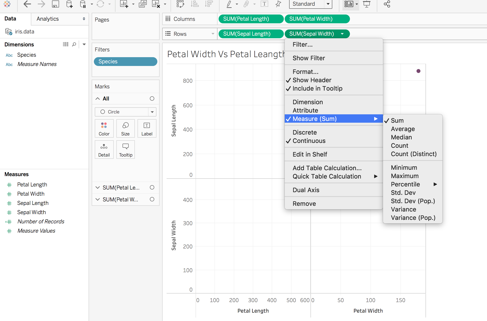
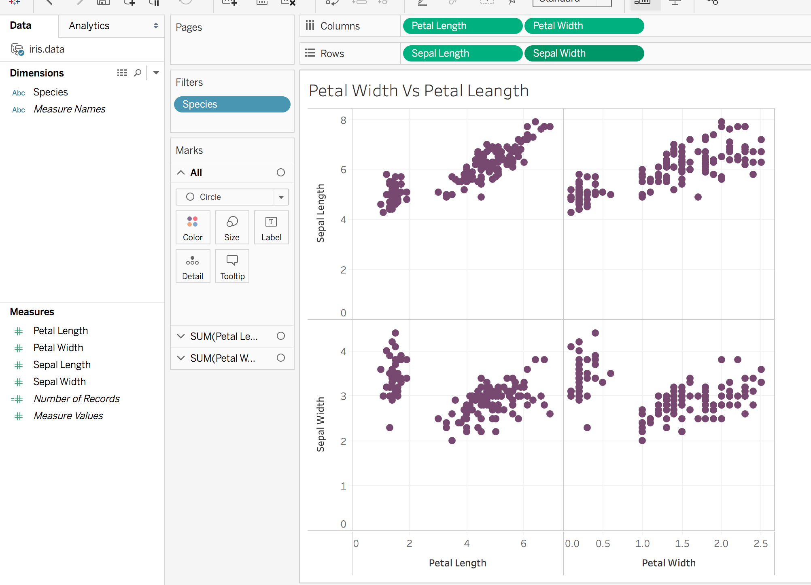
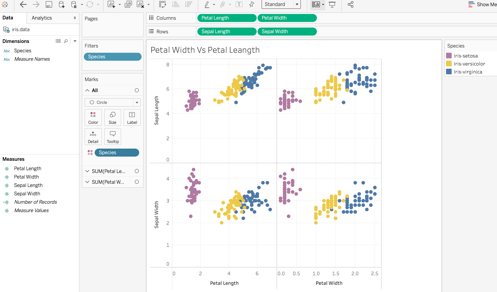
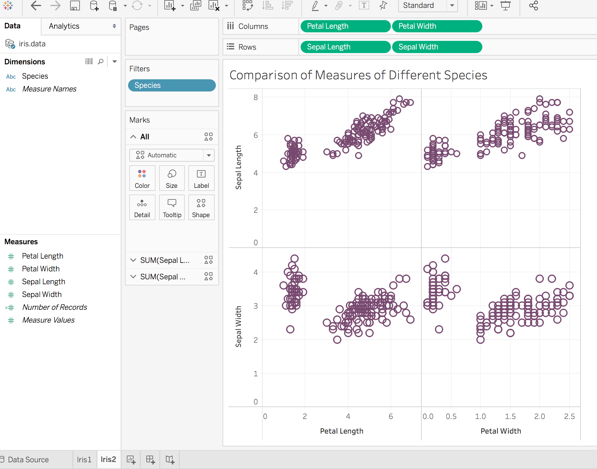
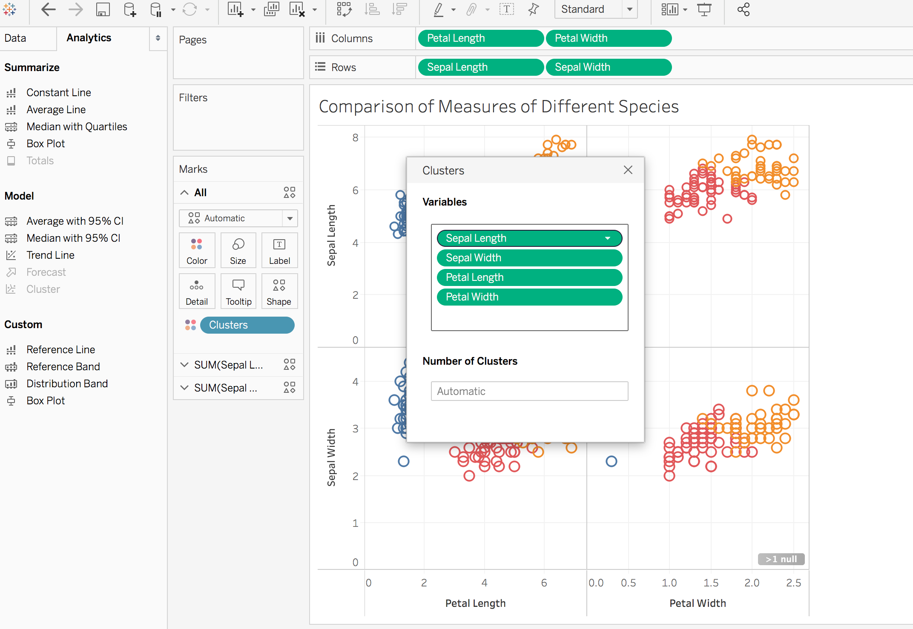
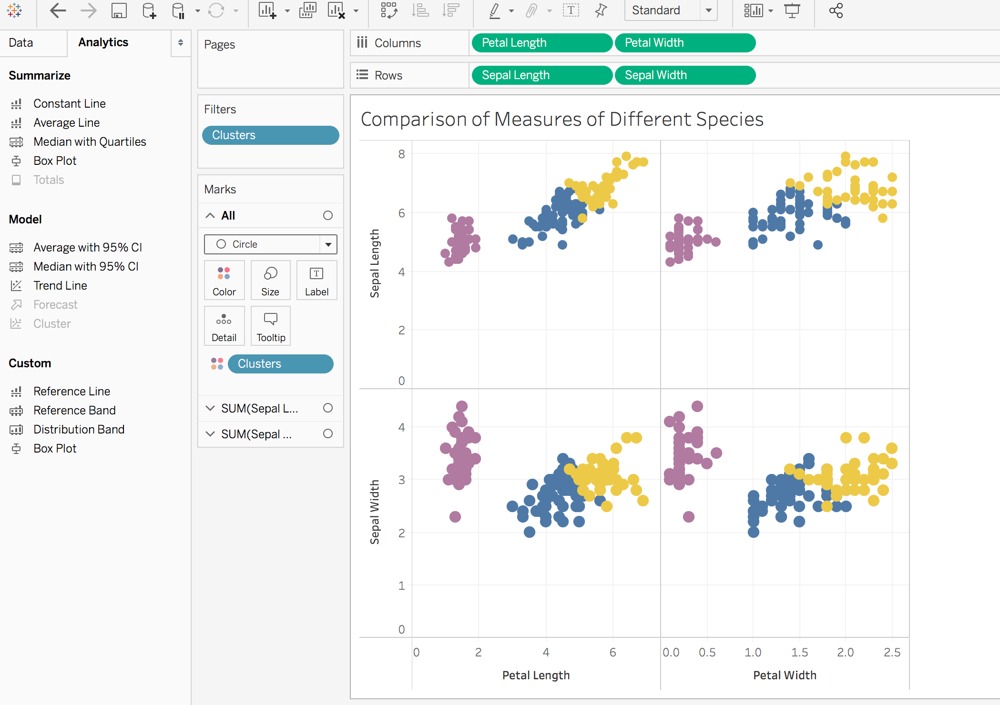

+++
title = "Visualization with Tableau"
subtitle = "Cluster Analysis using Tableau"

date = 2019-03-13T00:00:00
lastmod = 2019-03-13T00:00:00
draft = false

# Authors. Comma separated list, e.g. `["Bob Smith", "David Jones"]`.
authors = ["admin"]

tags = ["Tableau", "Clustring", "Iris data", "Dimensions", "Data Analysis"]
summary = "This post introduces you to the clustering analysis on Iris flower data using Tableau"

# Projects (optional).
#   Associate this post with one or more of your projects.
#   Simply enter your project's folder or file name without extension.
#   E.g. `projects = ["deep-learning"]` references 
#   `content/project/deep-learning/index.md`.
#   Otherwise, set `projects = []`.
# projects = ["internal-project"]

# Featured image
# To use, add an image named `featured.jpg/png` to your project's folder. 
[image]
  # Caption (optional)
  caption = "Image credit: [**Unsplash**](https://unsplash.com/photos/CpkOjOcXdUY)"

  # Focal point (optional)
  # Options: Smart, Center, TopLeft, Top, TopRight, Left, Right, BottomLeft, Bottom, BottomRight
  focal_point = ""

  # Show image only in page previews?
  preview_only = false

# Set captions for image gallery.

[[gallery_item]]
album = "gallery"
image = "theme-default.png"
caption = "Default"

[[gallery_item]]
album = "gallery"
image = "theme-ocean.png"
caption = "Ocean"

[[gallery_item]]
album = "gallery"
image = "theme-forest.png"
caption = "Forest"

[[gallery_item]]
album = "gallery"
image = "theme-dark.png"
caption = "Dark"

[[gallery_item]]
album = "gallery"
image = "theme-apogee.png"
caption = "Apogee"

[[gallery_item]]
album = "gallery"
image = "theme-1950s.png"
caption = "1950s"

[[gallery_item]]
album = "gallery"
image = "theme-coffee-playfair.png"
caption = "Coffee theme with Playfair font"

[[gallery_item]]
album = "gallery"
image = "theme-cupcake.png"
caption = "Cupcake"
+++

## Iris Data Set

For learning the basics of Tableau, we'll use the very famous [Iris ](https://archive.ics.uci.edu/ml/machine-learning-databases/iris/) Dataset. It is available from the UCI Machine Learning Repository.
\
This is a  simple data set with 150 records and 4 attributes. The 4 instances are sepal length, sepal width, petal length, and petal width. There is a class attribute which has three values: Iris Setosa, Iris versicolor and Iris Virginica.

## Connecting to the Source

Let's import the above data text files into Tableau. We can view the various instances and attributes of our dataset.
Here, we can also change the data type of the various attributes.

## Dimensions and Measures

By default, Tableau marks all the numerical fields as "Measures" and all the categorical fields as "Dimensions". So in our case, Species is a dimension and all other attributes are meansures.

## Clustering 

Clustering is grouping a set of observations into subsets (called clusters) so that observations in the same cluster are similar in some sense. \
We will perform the analysis in both Tableau and R using the same Iris data.

## Let's Do it 

First, we launch a new sheet and rename it to Iris1. Drag the measures petal length, petal width to columns and sepal length, width to rows.

Next, we disable aggregation of measures. Go to the Analysis and click on Aggregate Measures.You will see a change in your sheet. \

We are analyzing all the 4 measures. You can select different measures from the measures section. \
The above scatter-plots do not differentiate between any of the species. In the the Iris data set, the class atttribute specifies the flower species. \
We can differentiate between the different species by giving them different colors. We can do this by dragging ‘Species’ dimension to the color box under Marks which shows the distinct species groups as below:\

You can also choose other colors by clicking on the "Color" tab.

## What if there is no existing class ?

In the above data set, we see that there is already a species class. What if we don't have a class and want to identify the clusters based on the given 4 measures. We can do this through Cluster Analysis.\
Create a new sheet ("Iris2") and follow the previous steps to recreate the plot.

Now, go to the  Analytics tab, and drag ‘Clusters’ as shown in the figure below. Tableau automatically identifies the best number of clusters. 

I have changed the color for better understanding in the nexet figure. You can see that Tableau created the 3 clusters quite similar to we got using the species class.

This is just a simple anaysis using Tableau. You can try the same with another dataset.
