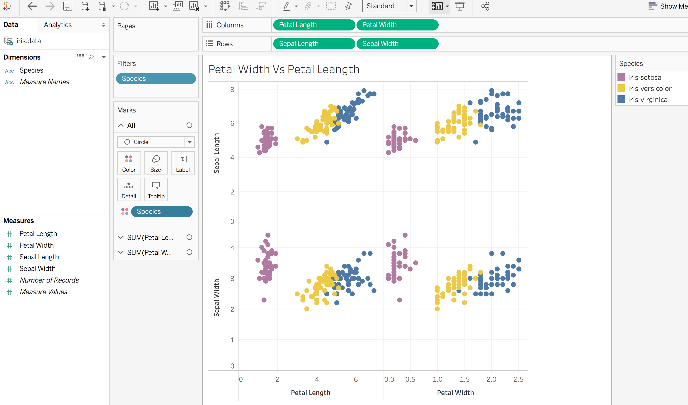

+++
title = "Visualization with Tableau"
subtitle = "Cluster Analysis using Tableau"

date = 2016-04-20T00:00:00
lastmod = 2018-01-13T00:00:00
draft = false

# Authors. Comma separated list, e.g. `["Bob Smith", "David Jones"]`.
authors = ["admin"]

tags = ["Tableau", "Clustring", "Iris data", "Dimensions", "Data Analysis"]
summary = "This post introduces you to the clustering analysis on Iris flower data using Tableau"

# Projects (optional).
#   Associate this post with one or more of your projects.
#   Simply enter your project's folder or file name without extension.
#   E.g. `projects = ["deep-learning"]` references 
#   `content/project/deep-learning/index.md`.
#   Otherwise, set `projects = []`.
# projects = ["internal-project"]

# Featured image
# To use, add an image named `featured.jpg/png` to your project's folder. 
[image]
  # Caption (optional)
  caption = "Image credit: [**Unsplash**](https://unsplash.com/photos/CpkOjOcXdUY)"

  # Focal point (optional)
  # Options: Smart, Center, TopLeft, Top, TopRight, Left, Right, BottomLeft, Bottom, BottomRight
  focal_point = ""

  # Show image only in page previews?
  preview_only = false

# Set captions for image gallery.

[[gallery_item]]
album = "gallery"
image = "theme-default.png"
caption = "Default"

[[gallery_item]]
album = "gallery"
image = "theme-ocean.png"
caption = "Ocean"

[[gallery_item]]
album = "gallery"
image = "theme-forest.png"
caption = "Forest"

[[gallery_item]]
album = "gallery"
image = "theme-dark.png"
caption = "Dark"

[[gallery_item]]
album = "gallery"
image = "theme-apogee.png"
caption = "Apogee"

[[gallery_item]]
album = "gallery"
image = "theme-1950s.png"
caption = "1950s"

[[gallery_item]]
album = "gallery"
image = "theme-coffee-playfair.png"
caption = "Coffee theme with Playfair font"

[[gallery_item]]
album = "gallery"
image = "theme-cupcake.png"
caption = "Cupcake"
+++

## Iris Data Set

For learning basics of Tableau, I am using the very famous [Iris ](https://archive.ics.uci.edu/ml/machine-learning-databases/iris/) Dataset from the UCI Machine Learning Repository.
\
This is a  simple data set with 150 instances and 4 attributes and a class namely, sepal length, sepal width, petal length, petal width and the class attribute which has three classes, namely, Iris Setosa, Iris versicolor and Iris Virginica.

## Connecting to the Source

Let's connect to the above data text files into Tableau.We can view the various instances and attributes of our dataset.
Here, we can also change the data type of the various attributes.

## Dimensions and Measures

By default all the numerical fields are categorised as  "Measures" and all the categorical data is termed as "Dimensions". So in our case, Species is a dimension and all other attributes are meansures.

## Clustering 

Clustering is the group of a set of observations into subsets (called clusters) so that observations in the same cluster are similar in some sense. \
We will perform the analysis in both Tableau and R using the same Iris data.

## Let's Do it 

First, i have launched a new sheet and renamed it to Iris1.Drag the measures petal length, petal width to columns and sepal length, width to rows.

Next, I have disabled aggregation of measures by going to the Analysis and then click on Aggregate Measures.You will see a change in your sheet. \

I am analyzing all the 4 measures, for simplicity you can also choose 2 measures. \
Now, if you have observed the above figure, the above scatter-plots does not differentiate between any of the species. But in this case, the since the Iris data set already has a class specifying flower species of above measures. \
So let's see it by dragging ‘Species’ dimension to the  color which shows the distinct species groups as below:\

You can also choose other colors by clicking on the "Color" tab.

## What if there is No Existing Dimension ?

In the above data set, we see that there is already a species dimension but let's imagine we don't have any given class and  we wanteto identify the clusters based on the given 4 measures.\
Lets explore how it can be done using Cluster Analysis.I am creating a new Sheet with name "Iris2" and once again i will start with the initial plot we had.

Now, go to the  Analytics tab, and drag ‘Clusters’ as shown in the figure below. Tableau automatically identifies the number of clusters. 

I have changed the color for better understanding. You can see that Tableau created the same 3 clusters which we created using the species dimenion.

This is just a simple anaysis using Tableau. You can try the same with another dataset.

