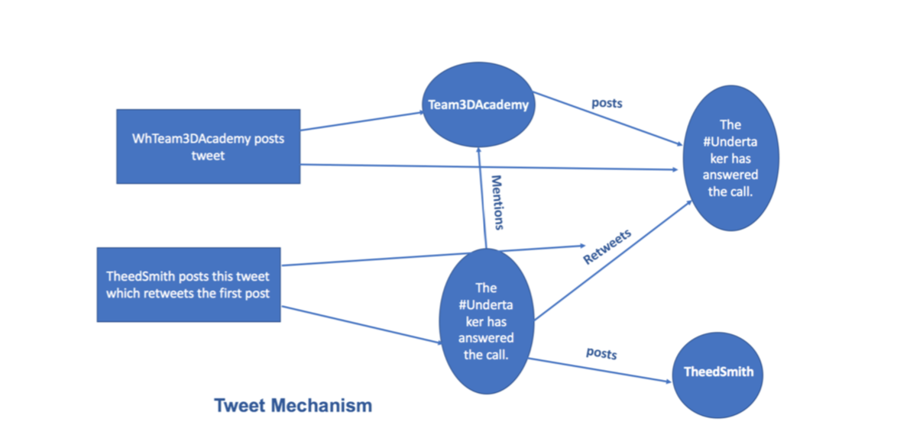
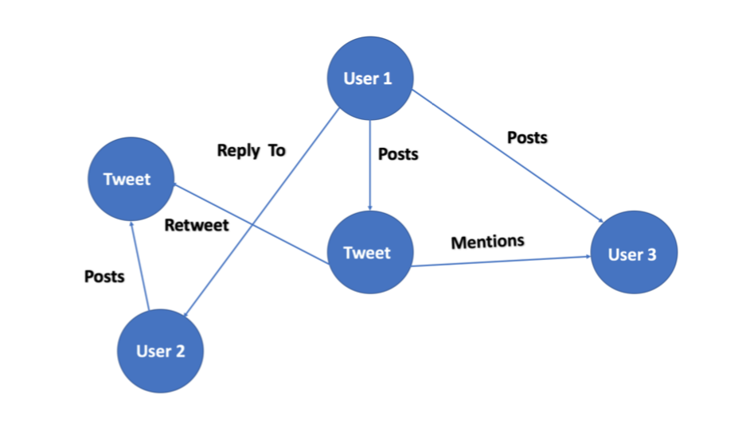
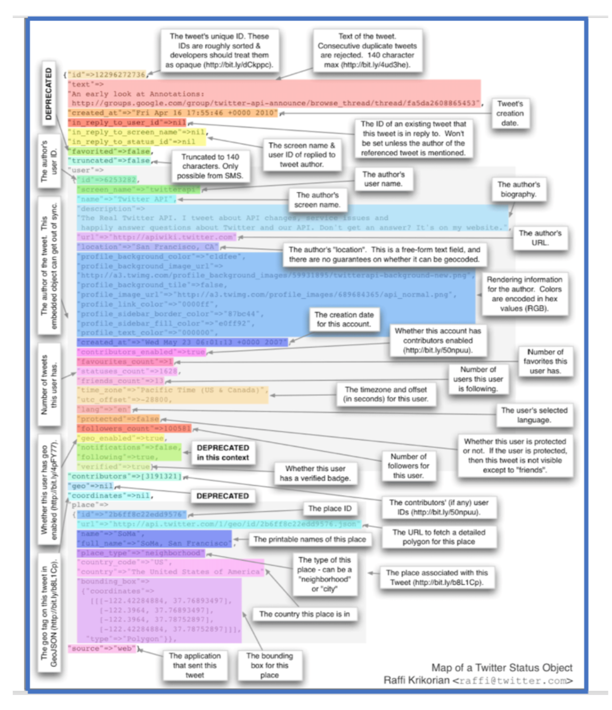
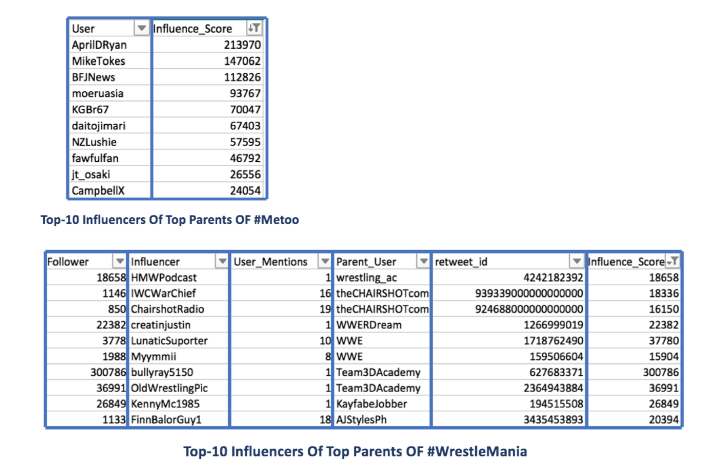
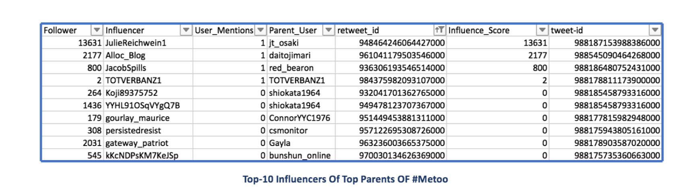
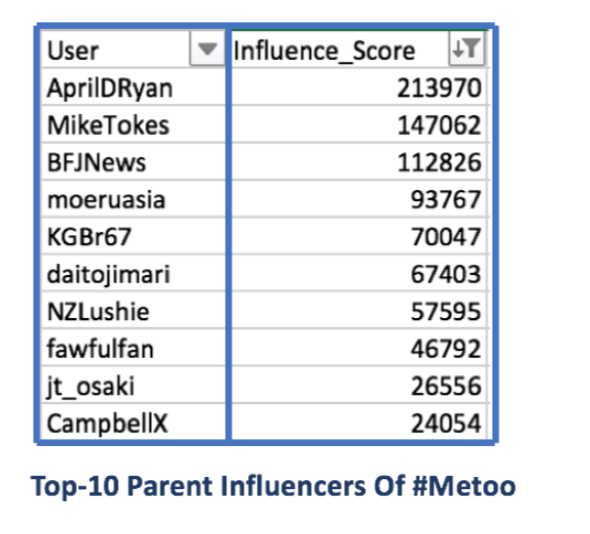

+++
# Project title.
title = "Twitter SuperFans"

# Date this page was created.
date = 2016-04-27T00:00:00

# Project summary to display on homepage.
summary = "How Influential are Your tweets?"

# Tags: can be used for filtering projects.
# Example: `tags = ["machine-learning", "deep-learning"]`
tags = ["Influential Users", "Friendship Graph", "Social Influence", "Retweets"]

# Optional external URL for project (replaces project detail page).
external_link = ""

# Slides (optional).
#   Associate this project with Markdown slides.
#   Simply enter your slide deck's filename without extension.
#   E.g. `slides = "example-slides"` references 
#   `content/slides/example-slides.md`.
#   Otherwise, set `slides = ""`.
slides = "example-slides"

# Links (optional).
url_pdf = ""
url_slides = ""
url_video = ""
url_code = ""

# Custom links (optional).
#   Uncomment line below to enable. For multiple links, use the form `[{...}, {...}, {...}]`.
links = [{icon_pack = "fab", icon="", name="Project Source Code", url = "https://github.com/Guneev9/Twitter-Topical-SuperFans"}]

# Featured image
# To use, add an image named `featured.jpg/png` to your project's folder. 
[image]
  # Caption (optional)
  caption = "Friendship Graph of Superfans"
  
  # Focal point (optional)
  # Options: Smart, Center, TopLeft, Top, TopRight, Left, Right, BottomLeft, Bottom, BottomRight
  focal_point = "Smart"
+++

# Introduction

Social Influence can be described as the ability to have an effect on the thoughts or actions of others. Influential members in on-line communities are becoming the new media to market products and sway opinions.Directed links in social media could represent anything from intimate friendships to common interests, or even a passion for breaking news or celebrity gossip. Such links determine the flow of information and further indicate a users influence on others. The objective of this analysis is to detect the influence in a specific topic on Twitter. \\
In more detail, from a collection of tweets matching a specified query, we want to detect the influential users. In order to address this objective, we first want to focus our search on the individuals who write in their personal accounts based on that trending topic, so we investigated which set of features can best lead us to the topic-specific influential users, and how these features can be expressed in a model to produce a top list of influential users.Based on these measures, we investigate the dynamics of user influence across topics.We make several interesting observations.We believe that these findings provide new insights for viral marketing and suggest that topological measures such as re-tweets reveals a lot about the influence of a user.

## Concept of Microblogging :

* It is one of the recent form of publishing of short text updates
* One of the most important and emerging form of micro-blogging services is Twitter within limit of 140 characters
* The user whose updates are being followed is called the friend while the one who is following is called the follower

## How you Gain Influence on Twitter ?

There are various features hidden in tweet texts which are used to perform analysis: 

1. Retweets: These tell you about how willing people are to amplify your messages and help them spread. A retweet essentially says ”this is something I want my network to see”.

2. Screenname
These signal how much others want to talk to you or intentionally tag you, and also serves as an indicator for how willing you are to engage and tag others. Less replies signals less social interactions and more broadcast.

3. Follower Count
Usually, if a user on Twitter follows more amount of users than than those who follow them, it signals their desire to accumulate followers. A 50/50 ratio translates to some- one following back anyone who follows them, which includes spammers. Twitter users who follow significantly less than are followed indicate some selection process.

4. Tweet volume
This simply indicates how prolific a user is. Those with high volumes who retain high levels of engagement, list counts, re-tweets, and a healthy ratio are likely providing some type of value.

5. Favorites
Getting favoritism frequently does mean something, though because Twitter users leverage Favorites so differently, it’s nearly impossible to discern exactly what, other than you triggered a behavior (the action to Favorite) for some reason.

## Traditional Approaches :

These are based on Twitter features mentioned in the literature related to re-tweets, men- tions and followers :

1. Page rank
2. Mention Impact
3. Retweet Impact

## API Used :

We have used REST API to read and write data through simple HTTP primitives like GET and POST.Every tweet is stored as a form of  dictionary in JSON file.The API identify Twitter applications and users using OAuth and giving responses are in JSON format. Of course, there is a rate limit of Twitter REST APIs. We have handled rate limits using the exception handling mechanism and making it sleep for 60 seconds.

Following is the glance of json file :

## Data Set Used :

We have used REST API to build our data set by collecting 1 week old tweets for different topics using OAuth. We later used app handler instead of outh handler and extracted the tweets 2.5 times faster than old handler. We were limited to program with multiple threads, requesting 200 tweets per minute through the Twitter REST APIs to capture enough data.

We used the Search API of Twitter REST APIs to get Twitter messages, with the query operator to collect the messages containing the hashtag ♯WrestleMania. The response let us gain the message ID, user ID and all the detail information of each message in the form of json file,we collected the information of users who participated in the activity.We realized that this tag doesn’t have enough retweeters for our analysis.
We then tried another trending topic from twitter and chose ♯WrestleMania.It gave us good amount of parent users(1000) and further their 100 retweeters.We further chose 2 more trending topics on weekly basis and collected their 1000 parent users and further 100 re- tweeters.

We at the end collected 1000 parent tweets for the following 3 topics: 
1. ♯WrestleMania
2. ♯TaxDay
3. ♯Metoo

## Influence Score Logic :

Since influence is typically contextual, we have explored the effectiveness of the score across different domains. Users in domains were identified using the methodology described below, and ranked by their scores within their respective domains.In the context of a given Twitter community or topic, a particular user’s Influence Flow Score indicates how influential that user is within that community or topic.

Following is the algorithm used for each community(topic): 

a)Extraction of at least 100 users for each parent tweet based on their tweet id who have re-tweeted their tweet

b)Now, for every existing re-tweet id’s, we have followed the below steps:

i)First extract the screen name and follower count of this re-tweeter user using the api function
ii)Extraction of mentions of this user base don above hashtag and his parent screen name iii)Calculation of score by multiplying his follower count and his total mentions
iv)storing the scores along with other information in csv file

c)After performing the above steps for each parent, we will get csv files containing their re-tweeters and their score for further analysis

## Handling CSV Files :

Once we have collected the information for each parent user in a file. We have further pre-processed each file for fetching the top 10 influencers of each parent along with their score. We also retrieved top 10 parent influencers of the community by summing up their re-tweeter’s score.
At last we have saved these final files for further visualizations and development of our user interface for more clarity.

## Interactive User Interface 

Notebooks come alive when interactive widgets are used. Users can visualize and control changes in the data. Learning becomes an immersive, plus fun, experience. Users can easily see how changing inputs to a model impacts the results. In this project, we are showing a notebook with one of the simplest interactive control elements and how it can be integrated in a data modeling task to dynamically visualize the impact of model parameter changing.

We are using IPythons widgets for the same. We have two options for installing ipywid- gets. Basically, if we use pip, we also have to enable the ipywidget extension in our notebook to render it next time you start the notebook. We can enable it within any virtual environ- ment we use, so that the extension does not impact any other environment.

We followed the same process of enabling the ipywidget extension in our notebook. The same can also be done with the help of conda.

We also implemented a custom function to carry out below tasks:

1. On the fly 1000 tweets extraction 
2. Calculation of Influence scores 
3. Storing extracted results of csv files
4. Performing visualization

## Results 
We have 3 stored scores for 3 trending topics on weekly basis: 

1. WrestleMania
2. Metoo
3. TaxDay

Although we found lot of retweeters on WrestleMania and Metoo topic but unfortunately there were not much retweeters for TaxDay.This can also be possible because as per our algorithm, for an influence score to be calculated a parent users needs around 100 retweeters who tweet about hashtag and the parent(screen name) itself.

1. Wrestlemania: Below are the tables which show the influence scores of Top-10 parent users and then further their Top 10 re-tweeters score.

2. Metoo: Below are the tables which show the influence scores of Top-10 parent users and then further their Top 10 re-tweeters score.

