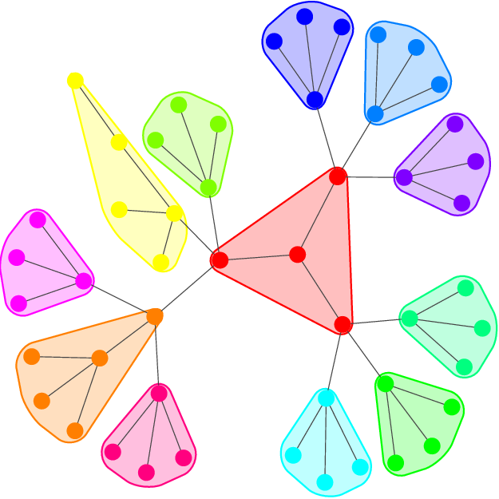
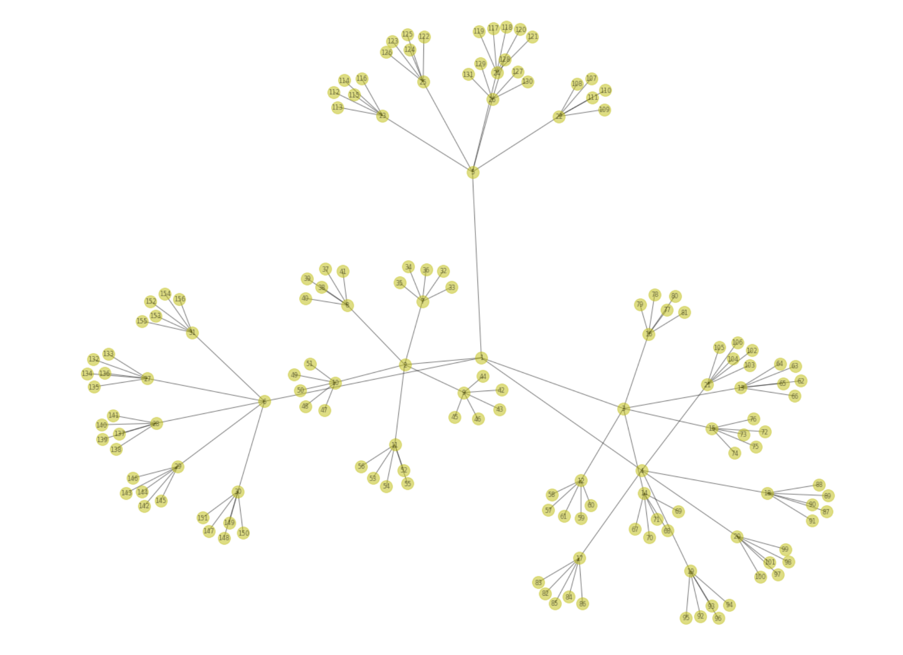
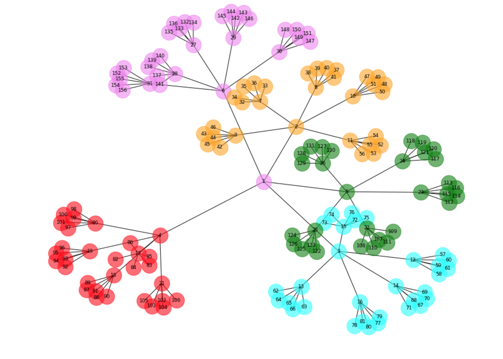

+++
# Project title.
title = "Twitter Community"

# Date this page was created.
date = 2016-04-27T00:00:00

# Project summary to display on homepage.
summary = "Community Detection and Friendhip Graph"

# Tags: can be used for filtering projects.
# Example: `tags = ["machine-learning", "deep-learning"]`
tags = ["Friends", "Networkx", "Community", "Tweets" , "Python" ,"Centrality" ,"Edge-Betweenness" , "Matplotlib", "Social Media Mining"]

# Optional external URL for project (replaces project detail page).
external_link = ""

# Slides (optional).
#   Associate this project with Markdown slides.
#   Simply enter your slide deck's filename without extension.
#   E.g. `slides = "example-slides"` references 
#   `content/slides/example-slides.md`.
#   Otherwise, set `slides = ""`.
slides = "example-slides"

# Links (optional).
url_pdf = ""
url_slides = ""
url_video = ""
url_code = ""

# Custom links (optional).
#   Uncomment line below to enable. For multiple links, use the form `[{...}, {...}, {...}]`.
links = [{icon_pack = "fab", icon="", name="Project Source Code", url = "https://github.com/Guneev9/Twitter-Friendship-Graph"}]

# Featured image
# To use, add an image named `featured.jpg/png` to your project's folder. 
[image]
  # Caption (optional)
  caption = "Friendship Graph of Superfans"
  
  # Focal point (optional)
  # Options: Smart, Center, TopLeft, Top, TopRight, Left, Right, BottomLeft, Bottom, BottomRight
  focal_point = "Smart"
+++

# Introduction

This project describes the Twitter friendship graph of any user with more than 10,000 followers and further the concept of community detection.I have used the Python library NetworkX, to deal with network data and solve interesting problems in network analysis. You can find a nice IPython Notebook with all the examples using the above link.

## Authorization :

I have created a separate dictionary "auth_dict" to retrieve authentication tokens and make requests from this API.
I have used a helper function that handles common HTTPErrors and return an updated
value for wait_period if the problem is a 500 level error.It blocks until the rate limit is reset if it's a rate limiting issue (429 error) and returns None for 401 and 404 errors, which requires special handling by the caller.

## Friends and Followers : 

I have used screen name or user id to get the friends and followers and store them.

## Edge Extraction :

I have created another function to populate friendship edges into followers.csv file. 
Following is the algorithm :

1. Start with user with more than 10,000 followers

2. Fetch its reciprocal friends

3. Then, from step-2 get its Top-5 reciprocal friends using the above get_user_profile() function

4. Append these to the csv file in order to create ege list

5. Then repeat the steps 2-4 till distance-3 so that we get atleast 100 nodes for graph

This will give followers.csv file which will be used to plot the community detection graph. I have used the 'Ronald_vanLoon' screen name for  getting the followers till depth 3.

## Friendship Graph

I have then used Netwrokx and matplotlib to plot the friend's graph.I read edgelist from the followers.csv file which is loaded using above Crawl_followers function.

## Community detection using Norman-Girvan Algorithm based on edge-betweeneness

* The Girvan–Newman algorithm detects communities by progressively removing edges from the original graph
* The algorithm removes the “most valuable” edge, traditionally the edge with the highest betweenness centrality, at each step
* As the graph breaks down into pieces, the tightly knit community structure is exposed and the result can be depicted as a dendrogram
* It is upto user that, till what depth, you want to break. I have break down the graph into communities till level-4(divisive clustering)

I have calculated the edge betweenness centrality using networkx library and then 
used girvan_newman() function to fetch the communities 

## Community Graph :

I have then plotted the graph showing the nodes by color of the community.

